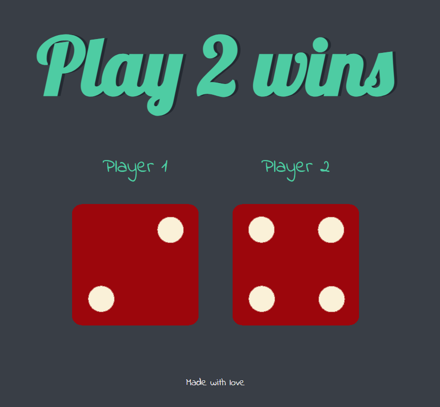

# **Dicee Game**


A simple web-based dice game where two players roll dice, and the result determines the winner.

## **Features**

- **Random Dice Rolls**: Rolls dice for two players.
- **Outcome Display**: Shows the winner or a draw based on the dice rolls.

## **How to Install**

1. **Clone the Repository**
   ```bash
   git clone https://github.com/mouryaansh10254/Dice-Game.git

2. **Navigate to the Project Directory**
   ```bash
   cd dicee-game
3. **Open the Project**

   Open 'index.html' in your web brower to view and interact with the game.
## **How to Use**
  - Refresh the page to roll the dice and see the outcome.

## **Technologies**
  - HTML
  - CSS
  - JavaSrcipt
